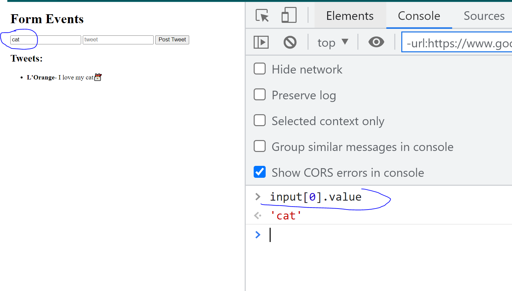

1) input.value

 

2) input.value update

3) Accessing the elements of the form (alternative way):

4) Process of removing the li:

When we expand on PointerEvent, we will find 'target':

## [Click for the dev tools console](https://verson-tech.github.io/FormEvents/)